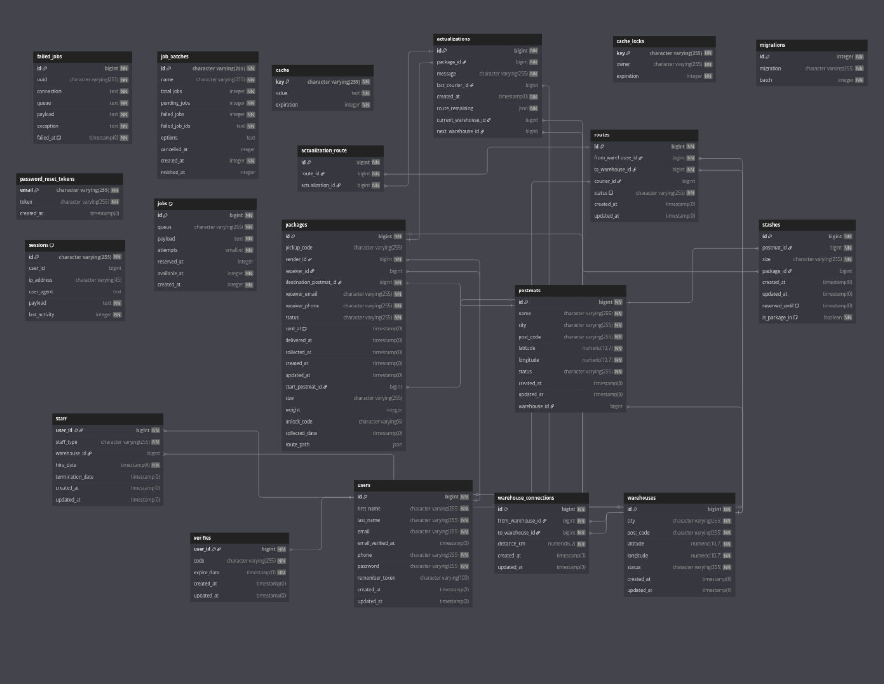

# Projekt AI1

[Repozytorium projektu](https://github.com/users/abackia/repo1)

[Tablica projektowa](https://github.com/users/abackia/projects/1)

---


### Temat projektu

.........................

---

### Zespół X

| Profil | Rola |
| ------ | ------ |
| [abackia](https://github.com/abackia) | lider zespołu |
| [bbacki](https://github.com/bbacki) | członek zespołu |
| [dadadadasas](https://github.com/dadadadasas) | członek zespołu |

---


## Opis projektu

Opis słowny założeń projektu, jaki fragment rzeczywistości jest objęty działaniem aplikacji, co użytkownik może zrobić w aplikacji.

Dostępne funkcjonalności:
* funkcjonalność 1,
* funkcjonalność 2,
* ...
* ...
* ...
* ...

### Narzędzia i technologie
* technologia 1, wersja ...
* technologia 2, wersja ...
* ...
* środowisko 1, wersja ...
* środowisko 2, wersja ...
* ...

### Uruchomienie aplikacji

Napisać, co trzeba mieć zainstalowane (oraz inne potrzebne dodatkowe informacje).

```
Umieścić komendy z start.bat

```

Przykładowi użytkownicy aplikacji:
* administrator: jan@email.com 1234
* użytkownik: anna@email.com 1234
* ...
* ...

### Baza danych



## Widoki aplikacji 


*Strona główna*


*Logowanie*


*Rejestracja*

...

*CRUD*

...

*Zarządzanie użytkownikami*

...

*Profil użytkownika*

...

*Dokonanie zakupu/wypożyczenia...*

...

itd.

...


...